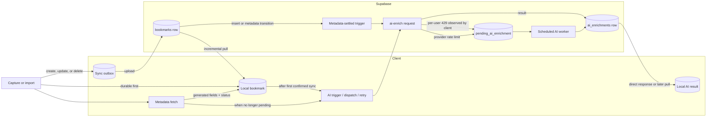
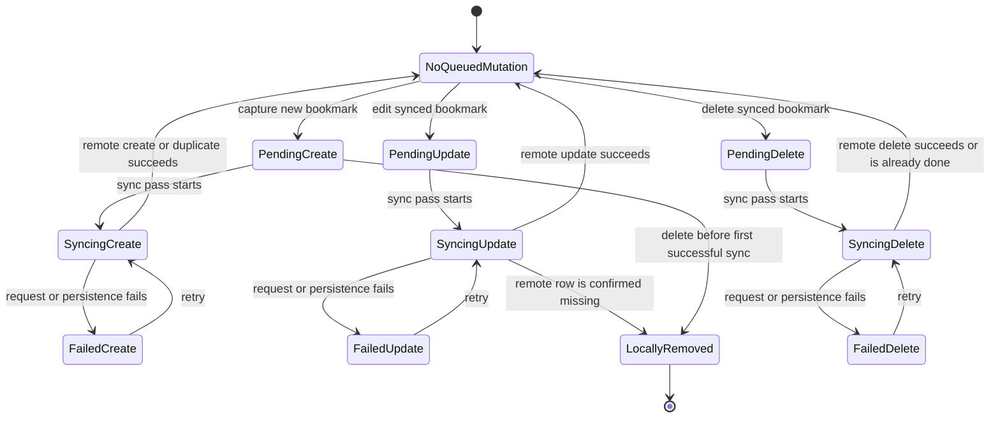
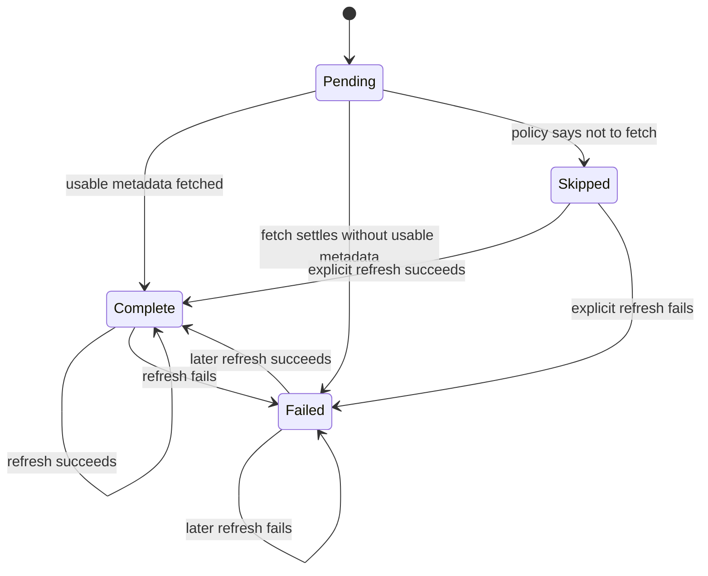
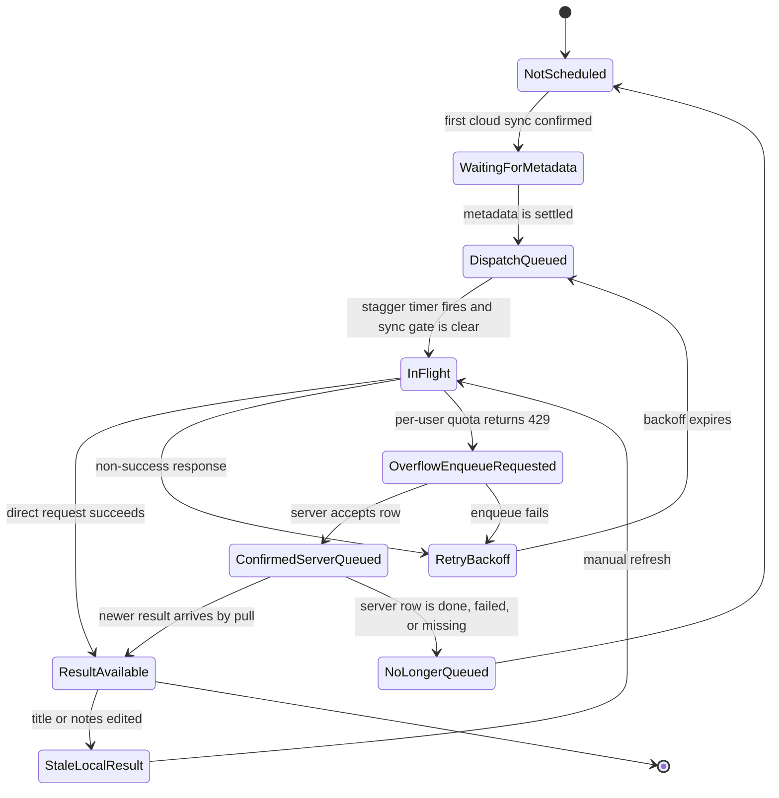
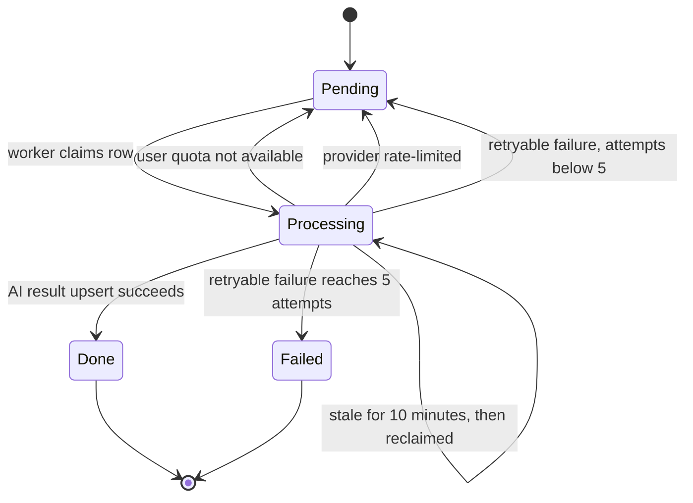
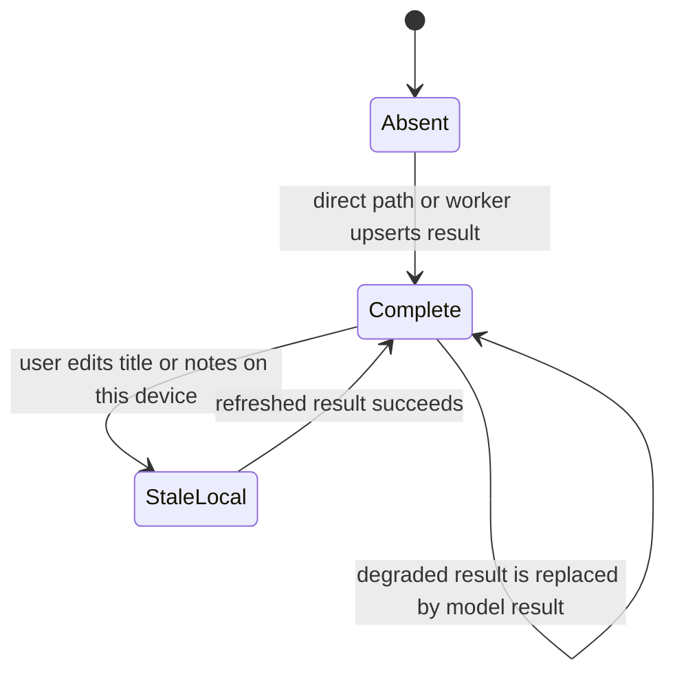
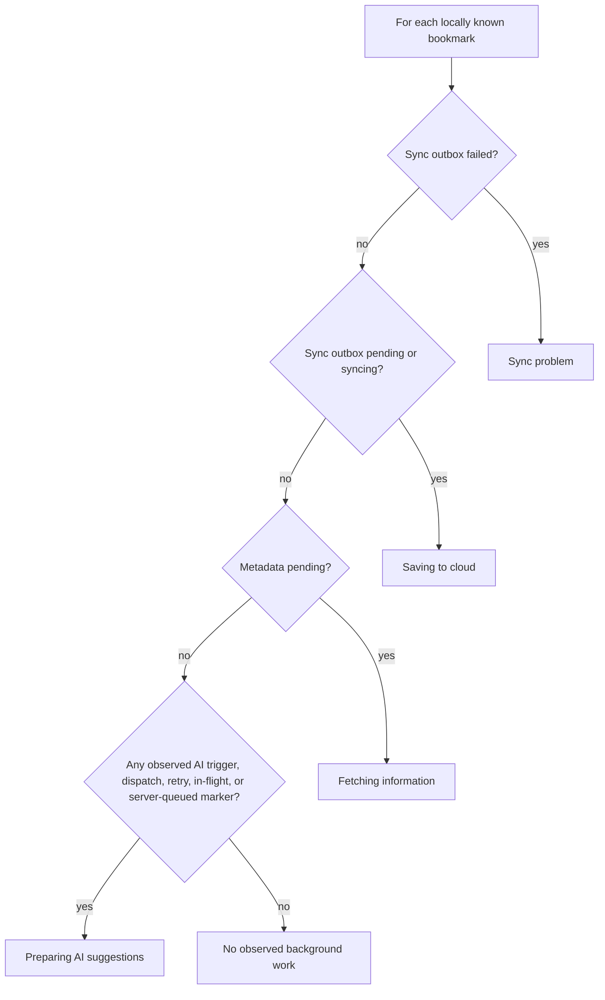

# Bookmark Processing Statechart

This document describes how one bookmark moves through local persistence,
cloud synchronization, metadata fetching, and AI enrichment. These concerns do
not form one finite-state machine. They are concurrent regions of a statechart,
with some transitions gating or triggering transitions in another region.

## The Model At A Glance



The state of a bookmark is therefore best treated as a tuple:

```text
BookmarkProcessingState =
  local bookmark state
  x local sync-outbox state
  x remote bookmark existence/state
  x metadata state
  x client AI scheduler state
  x server AI queue state
  x AI result state
```

No single field currently contains this entire state.

## Sources Of Truth

| Concern | Authoritative state | Persisted where | Important limitation |
| --- | --- | --- | --- |
| Unsynced remote mutation | Sync outbox entry and its `operation` | Client repository | The server cannot see `pending`, `syncing`, or `failed`. |
| User-facing sync mirror | `Bookmark.sync_status` and `ever_synced` | Client repository | It is not a complete replacement for inspecting the outbox. Some paths change the outbox before the bookmark mirror. |
| Remote bookmark | Row existence, `deleted_at`, and `updated_at` | `bookmarks` | There is no server-side `sync_status`. |
| Page metadata | `metadata_status` | Client and `bookmarks` | `failed` and `skipped` are settled states, not active work. |
| Automatic-AI intent | `enrichment_policy` | `bookmarks` | This per-bookmark server value is distinct from the client-global AI preference. |
| Client AI work | Trigger, dispatch, retry, in-flight, and confirmed-server-queued ID sets | Client memory and meta store | It is deliberately distributed rather than represented by one enum. |
| Server overflow work | `pending_ai_enrichment.status` | Postgres | The client only reconciles rows for IDs it already marked as server-queued. |
| AI result validity | `ai_enrichments.status` plus `degraded` fields | Server result; cached locally | This is a result state, not the server worker's progress state. |

## 1. Cloud Synchronization Region

The durable sync outbox is the authoritative record of remote work. A single
entry per bookmark contains the latest `create`, `update`, or `delete`
operation.



On a successful create or update, the client removes the outbox entry and
marks the local bookmark `sync_status = synced` and `ever_synced = true`.
Editing that bookmark later creates an update entry and returns the local mirror
to `pending`, while `ever_synced` remains true. A create that the server resolves
as a canonical-URL duplicate adopts the existing server row's ID before the
outbox entry is cleared.

The remote side does not participate in this state machine. It only observes
idempotent create/update/delete requests and stores the resulting row. A pull
later reconciles remote changes, except that queued local work wins until its
upload settles.

## 2. Metadata Region

Metadata fetching begins locally and may overlap a bookmark upload.



Only `pending` means metadata work is active. All three other values are
settled and may release an AI trigger. When a settled metadata status reaches
the server on insert, or when the server observes an actual transition from
`pending` to a settled value, `dispatch_ai_enrichment()` may start automatic AI
work if all of the following are true:

- the bookmark is active;
- `enrichment_policy = auto`; and
- no `ai_enrichments` row exists for the bookmark.

The server trigger is best effort and never blocks bookmark capture or sync.
The client scheduler is a second initiation path and acts as a backstop. Both
paths converge on the same one-row-per-bookmark AI-result upsert.

## 3. Client AI Scheduler Region

The client scheduler uses several ID sets because the states have different
durability and cancellation semantics.



The diagram shows the logical progression, but some markers intentionally
overlap. For example, a 429 arms local retry bookkeeping before the asynchronous
server enqueue is confirmed. Counting raw marker sizes would therefore
double-count bookmarks; all diagnostic totals must use unions of bookmark IDs.

The client-global AI preference gates local automatic triggering, retrying, and
dispatch. It does not cancel a request already in flight or work already
accepted by the server.

## 4. Server AI Overflow Region

The overflow queue handles work that could not complete immediately. A cron
tick claims rows in bounded, fair batches.



Quota deferrals and provider-rate-limit deferrals do not consume a retry
attempt. Provider calls that produce no result also refund a previously claimed
per-user quota slot. Other retryable failures increment `attempts`; the fifth
failed attempt makes the row terminal.

On success, the worker first upserts an `ai_enrichments` row with
`status = complete`, then marks the queue row `done`. Terminal queue rows remain
stored. They are no longer claimable.

## 5. AI Result Region

`ai_enrichments.status` describes the validity of a result, not active worker
progress.



Although the database constraint also permits `pending`, `failed`, and `stale`,
the current Edge Function writes completed results directly. The client marks a
cached complete result `stale` locally after a relevant edit; this local stale
marker is not the server worker's status. A provider failure may still produce
a `complete` result with `degraded = true` when deterministic fallback output
is available. If the provider failure was rate limiting, server overflow work
may coexist with that degraded completed result and later replace it.

## Cross-System Caveats

### The global AI preference is not server-global

The client preference (`off`, confirmation, or auto-accept) is not synchronized
as a server setting. The server trigger instead reads the bookmark's
`enrichment_policy`, which defaults to `auto` for ordinary saves and is set to
`skip` for import/restore paths that should not automatically spend AI quota.

Consequently, switching AI suggestions off reliably stops new local automatic
dispatch and retry work, but it does not by itself cancel or universally
prevent server-triggered or already-queued work. If the product intends “off”
to mean no automatic AI anywhere, that intent needs a synchronized server-side
representation or must be copied into each new bookmark's
`enrichment_policy`.

### Client counts are observed counts, not a global job census

The client records `serverQueued` only after its own overflow enqueue succeeds.
A queue row created entirely by the server path can exist without that local
marker. Therefore the Settings AI count can accurately deduplicate all
client-observed work, but it cannot be an exact census of every server-side job
without querying or subscribing to the user's complete active server queue.

### `done` does not mean the device has rendered the result

`pending_ai_enrichment.status = done` means the server result was stored. A
different device may not receive that result until its next pull. Server job
completion and client-visible result arrival are separate transitions.

## Settings: A Display-Only State Projection

Settings should not sum the current upload, metadata, and AI counts because the
same bookmark may occupy more than one region. Instead, derive one exclusive
display stage per bookmark using a documented precedence:



Pause, AI-off, and quota cooldown are modifiers on a stage, not additional
bookmark counts. Examples include `Saving to cloud · paused` and
`AI suggestions · resumes at 15:00`.

This projection has three useful properties:

1. Each bookmark contributes to at most one visible stage.
2. The sum of stage counts equals the displayed locally observed total.
3. Internal state remains lossless; the simplified stage exists only for UX.

It does **not** make the total globally exact across client and server. That
requires closing the server-observability gap described above.

## Implementation References

- Domain state types: `apps/mobile/src/domain/types.ts`
- Client orchestration and diagnostic unions: `apps/mobile/src/store/bookmarks.tsx`
- Sync-outbox transitions: `apps/mobile/src/sync/sync-bookmarks.ts`
- Server bookmark and AI-result schema: `supabase/migrations/20260611000000_initial_schema.sql`
- Server overflow queue and claim transition: `supabase/migrations/20260723150000_pending_ai_enrichment_queue.sql`
- Server metadata-settled trigger: `supabase/migrations/20260803215821_bookmarks_enrichment_policy.sql`
- AI direct and worker paths: `supabase/functions/ai-enrich/index.ts`
- Overflow retry cap: `supabase/functions/ai-enrich/batch-worker.ts`
