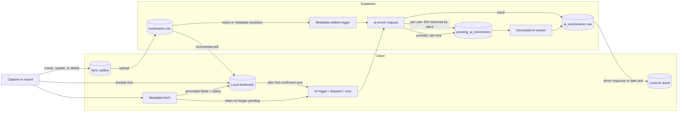
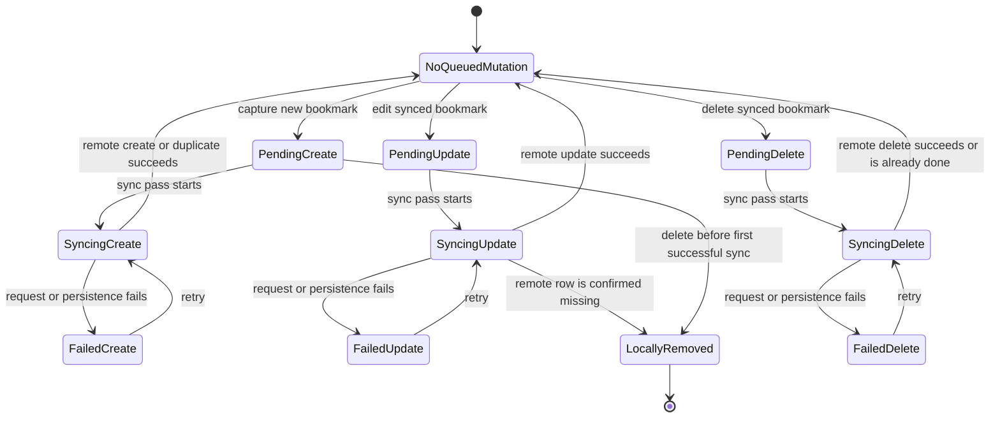
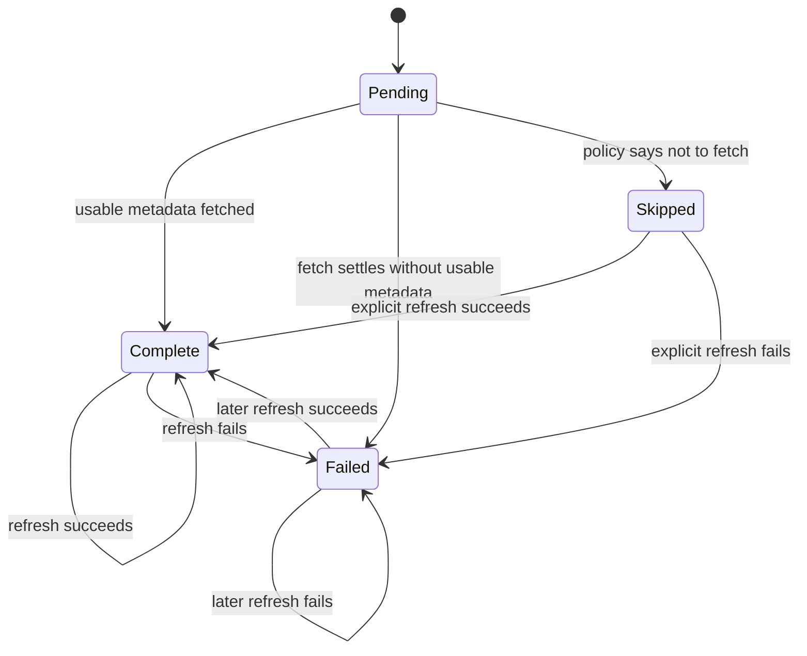
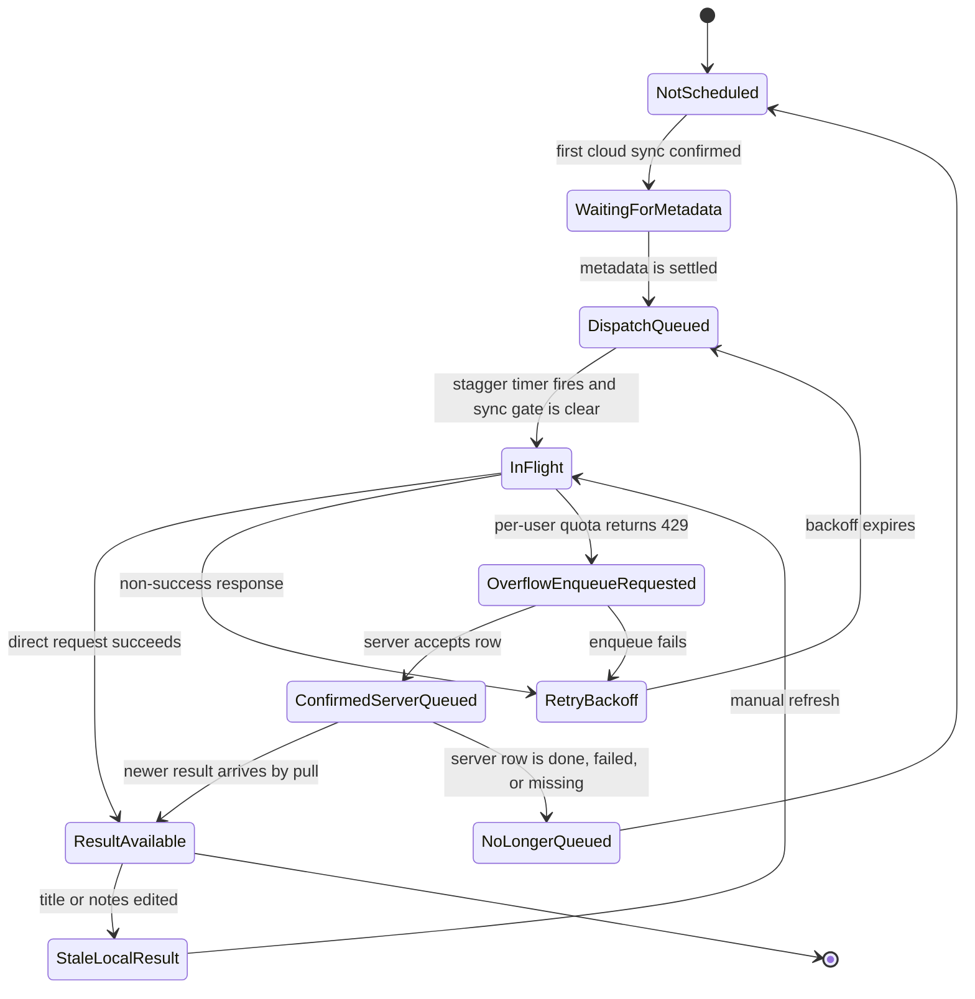
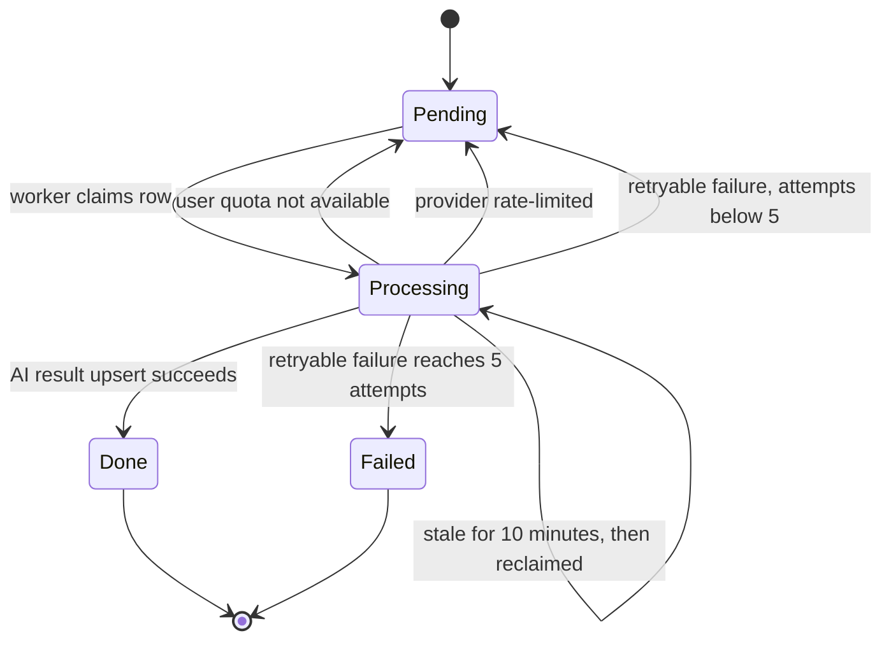
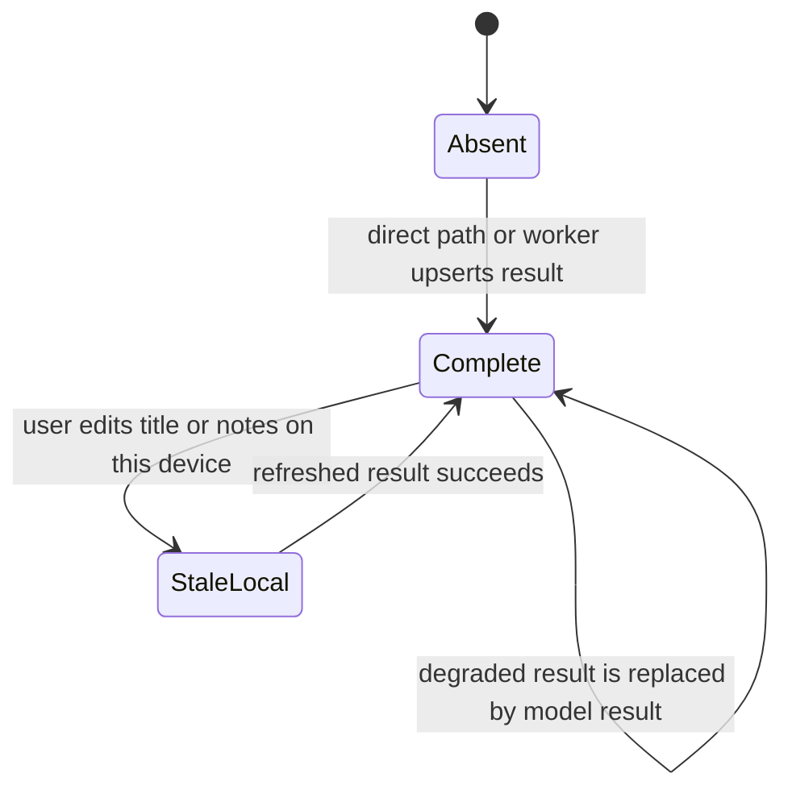
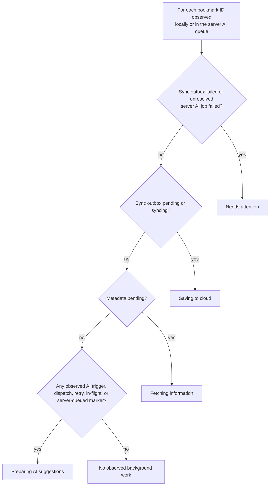

# Bookmark Processing Statechart

This document describes how one bookmark moves through local persistence,
cloud synchronization, metadata fetching, and AI enrichment. These concerns do
not form one finite-state machine. They are concurrent regions of a statechart,
with some transitions gating or triggering transitions in another region.

## The Model At A Glance


```mermaid
flowchart LR
  capture[Capture or import]

  subgraph client[Client]
    local[(Local bookmark)]
    outbox[(Sync outbox)]
    metadata[Metadata fetch]
    aiLocal[AI trigger / dispatch / retry]
    localResult[(Local AI result)]
  end

  subgraph server[Supabase]
    remote[(bookmarks row)]
    trigger[Metadata-settled trigger]
    direct[ai-enrich request]
    overflow[(pending_ai_enrichment)]
    worker[Scheduled AI worker]
    remoteResult[(ai_enrichments row)]
  end

  capture -->|durable first| local
  capture -->|create, update, or delete| outbox
  capture --> metadata
  outbox -->|upload| remote
  metadata -->|generated fields + status| local
  remote -->|insert or metadata transition| trigger
  trigger --> direct
  local -->|after first confirmed sync| aiLocal
  metadata -->|when no longer pending| aiLocal
  aiLocal --> direct
  direct -->|result| remoteResult
  direct -->|per-user 429 observed by client| overflow
  direct -->|provider rate limit| overflow
  overflow --> worker
  worker --> remoteResult
  remoteResult -->|direct response or later pull| localResult
  remote -->|incremental pull| local
```

The state of a bookmark is therefore best treated as a tuple:

```text
BookmarkProcessingState =
  local bookmark state
  x local sync-outbox state
  x remote bookmark existence/state
  x metadata state
  x client AI scheduler state
  x server AI queue state
  x AI result state
```

No single field currently contains this entire state.

## Sources Of Truth

| Concern | Authoritative state | Persisted where | Important limitation |
| --- | --- | --- | --- |
| Unsynced remote mutation | Sync outbox entry and its `operation` | Client repository | The server cannot see `pending`, `syncing`, or `failed`. |
| User-facing sync mirror | `Bookmark.sync_status` and `ever_synced` | Client repository | It is not a complete replacement for inspecting the outbox. Some paths change the outbox before the bookmark mirror. |
| Remote bookmark | Row existence, `deleted_at`, and `updated_at` | `bookmarks` | There is no server-side `sync_status`. |
| Page metadata | `metadata_status` | Client and `bookmarks` | `failed` and `skipped` are settled states, not active work. |
| Automatic-AI intent | `enrichment_policy` | `bookmarks` | This per-bookmark server value is distinct from the client-global AI preference. |
| Client AI work | Trigger, dispatch, retry, in-flight, and confirmed-server-queued ID sets | Client memory and meta store | It is deliberately distributed rather than represented by one enum. |
| Server overflow work | `pending_ai_enrichment.status` | Postgres | Settings fetches an account-wide ID/status snapshot; it is eventually consistent between refreshes. |
| AI result validity | `ai_enrichments.status` plus `degraded` fields | Server result; cached locally | This is a result state, not the server worker's progress state. |

## 1. Cloud Synchronization Region

The durable sync outbox is the authoritative record of remote work. A single
entry per bookmark contains the latest `create`, `update`, or `delete`
operation.


```mermaid
stateDiagram-v2
  [*] --> NoQueuedMutation

  NoQueuedMutation --> PendingCreate: capture new bookmark
  NoQueuedMutation --> PendingUpdate: edit synced bookmark
  NoQueuedMutation --> PendingDelete: delete synced bookmark

  PendingCreate --> SyncingCreate: sync pass starts
  FailedCreate --> SyncingCreate: retry
  SyncingCreate --> NoQueuedMutation: remote create or duplicate succeeds
  SyncingCreate --> FailedCreate: request or persistence fails

  PendingUpdate --> SyncingUpdate: sync pass starts
  FailedUpdate --> SyncingUpdate: retry
  SyncingUpdate --> NoQueuedMutation: remote update succeeds
  SyncingUpdate --> FailedUpdate: request or persistence fails
  SyncingUpdate --> LocallyRemoved: remote row is confirmed missing

  PendingDelete --> SyncingDelete: sync pass starts
  FailedDelete --> SyncingDelete: retry
  SyncingDelete --> NoQueuedMutation: remote delete succeeds or is already done
  SyncingDelete --> FailedDelete: request or persistence fails

  PendingCreate --> LocallyRemoved: delete before first successful sync
  LocallyRemoved --> [*]
```

On a successful create or update, the client removes the outbox entry and
marks the local bookmark `sync_status = synced` and `ever_synced = true`.
Editing that bookmark later creates an update entry and returns the local mirror
to `pending`, while `ever_synced` remains true. A create that the server resolves
as a canonical-URL duplicate adopts the existing server row's ID before the
outbox entry is cleared.

The remote side does not participate in this state machine. It only observes
idempotent create/update/delete requests and stores the resulting row. A pull
later reconciles remote changes, except that queued local work wins until its
upload settles.

## 2. Metadata Region

Metadata fetching begins locally and may overlap a bookmark upload.


```mermaid
stateDiagram-v2
  [*] --> Pending
  Pending --> Complete: usable metadata fetched
  Pending --> Failed: fetch settles without usable metadata
  Pending --> Skipped: policy says not to fetch

  Complete --> Complete: refresh succeeds
  Complete --> Failed: refresh fails
  Failed --> Complete: later refresh succeeds
  Failed --> Failed: later refresh fails
  Skipped --> Complete: explicit refresh succeeds
  Skipped --> Failed: explicit refresh fails
```

Only `pending` means metadata work is active. All three other values are
settled and may release an AI trigger. When a settled metadata status reaches
the server on insert, or when the server observes an actual transition from
`pending` to a settled value, `dispatch_ai_enrichment()` may start automatic AI
work if all of the following are true:

- the bookmark is active;
- `enrichment_policy = auto`; and
- no `ai_enrichments` row exists for the bookmark.

The server trigger is best effort and never blocks bookmark capture or sync.
The client scheduler is a second initiation path and acts as a backstop. Both
paths converge on the same one-row-per-bookmark AI-result upsert.

## 3. Client AI Scheduler Region

The client scheduler uses several ID sets because the states have different
durability and cancellation semantics.


```mermaid
stateDiagram-v2
  [*] --> NotScheduled
  NotScheduled --> WaitingForMetadata: first cloud sync confirmed
  WaitingForMetadata --> DispatchQueued: metadata is settled
  DispatchQueued --> InFlight: stagger timer fires and sync gate is clear

  InFlight --> ResultAvailable: direct request succeeds
  InFlight --> RetryBackoff: non-success response
  RetryBackoff --> DispatchQueued: backoff expires

  InFlight --> OverflowEnqueueRequested: per-user quota returns 429
  OverflowEnqueueRequested --> ConfirmedServerQueued: server accepts row
  OverflowEnqueueRequested --> RetryBackoff: enqueue fails

  ConfirmedServerQueued --> ResultAvailable: newer result arrives by pull
  ConfirmedServerQueued --> NoLongerQueued: server row is done, failed, or missing
  NoLongerQueued --> NotScheduled

  ResultAvailable --> StaleLocalResult: title or notes edited
  StaleLocalResult --> InFlight: manual refresh
  ResultAvailable --> [*]
```

The diagram shows the logical progression, but some markers intentionally
overlap. For example, a 429 arms local retry bookkeeping before the asynchronous
server enqueue is confirmed. Counting raw marker sizes would therefore
double-count bookmarks; all diagnostic totals must use unions of bookmark IDs.

The client-global AI preference gates local automatic triggering, retrying, and
dispatch. It does not cancel a request already in flight or work already
accepted by the server.

## 4. Server AI Overflow Region

The overflow queue handles work that could not complete immediately. A cron
tick claims rows in bounded, fair batches.


```mermaid
stateDiagram-v2
  [*] --> Pending
  Pending --> Processing: worker claims row

  Processing --> Done: AI result upsert succeeds
  Processing --> Pending: user quota not available
  Processing --> Pending: provider rate-limited
  Processing --> Pending: retryable failure, attempts below 5
  Processing --> Failed: retryable failure reaches 5 attempts
  Processing --> Processing: stale for 10 minutes, then reclaimed

  Done --> [*]
  Failed --> [*]
```

Quota deferrals and provider-rate-limit deferrals do not consume a retry
attempt. Provider calls that produce no result also refund a previously claimed
per-user quota slot. Other retryable failures increment `attempts`; the fifth
failed attempt makes the row terminal.

On success, the worker first upserts an `ai_enrichments` row with
`status = complete`, then marks the queue row `done`. Terminal queue rows remain
stored. They are no longer claimable.

## 5. AI Result Region

`ai_enrichments.status` describes the validity of a result, not active worker
progress.


```mermaid
stateDiagram-v2
  [*] --> Absent
  Absent --> Complete: direct path or worker upserts result
  Complete --> StaleLocal: user edits title or notes on this device
  StaleLocal --> Complete: refreshed result succeeds
  Complete --> Complete: degraded result is replaced by model result
```

Although the database constraint also permits `pending`, `failed`, and `stale`,
the current Edge Function writes completed results directly. The client marks a
cached complete result `stale` locally after a relevant edit; this local stale
marker is not the server worker's status. A provider failure may still produce
a `complete` result with `degraded = true` when deterministic fallback output
is available. If the provider failure was rate limiting, server overflow work
may coexist with that degraded completed result and later replace it.

## Cross-System Caveats

### The global AI preference is not server-global

The client preference (`off`, confirmation, or auto-accept) is not synchronized
as a server setting. The server trigger instead reads the bookmark's
`enrichment_policy`, which defaults to `auto` for ordinary saves and is set to
`skip` for import/restore paths that should not automatically spend AI quota.

Consequently, switching AI suggestions off reliably stops new local automatic
dispatch and retry work, but it does not by itself cancel or universally
prevent server-triggered or already-queued work. If the product intends “off”
to mean no automatic AI anywhere, that intent needs a synchronized server-side
representation or must be copied into each new bookmark's
`enrichment_policy`.

### Client counts are observed counts, not a global job census

The client records `serverQueued` only after its own overflow enqueue succeeds.
A queue row created entirely by the server path can exist without that local
marker. Therefore the Settings AI count can accurately deduplicate all
client-observed work, but it cannot be an exact census of every server-side job
without querying or subscribing to the user's complete active server queue.

### `done` does not mean the device has rendered the result

`pending_ai_enrichment.status = done` means the server result was stored. A
different device may not receive that result until its next pull. Server job
completion and client-visible result arrival are separate transitions.

## Settings: A Display-Only State Projection

Settings should not sum the current upload, metadata, and AI counts because the
same bookmark may occupy more than one region. Instead, derive one exclusive
display stage per bookmark using a documented precedence:


```mermaid
flowchart TD
  start[For each bookmark ID observed<br/>locally or in the server AI queue]
  qFailed{Sync outbox failed or unresolved<br/>server AI job failed?}
  qActive{Sync outbox pending or syncing?}
  metadata{Metadata pending?}
  ai{Any observed AI trigger, dispatch, retry, in-flight, or server-queued marker?}

  start --> qFailed
  qFailed -->|yes| syncError[Needs attention]
  qFailed -->|no| qActive
  qActive -->|yes| cloud[Saving to cloud]
  qActive -->|no| metadata
  metadata -->|yes| info[Fetching information]
  metadata -->|no| ai
  ai -->|yes| aiStage[Preparing AI suggestions]
  ai -->|no| settled[No observed background work]
```

Pause, AI-off, and quota cooldown are modifiers on a stage, not additional
bookmark counts. Examples include `Saving to cloud · paused` and
`AI suggestions · resumes at 15:00`.

This projection has three useful properties:

1. Each bookmark contributes to at most one visible stage.
2. The sum of stage counts equals the displayed observed total.
3. Internal state remains lossless; the simplified stage exists only for UX.

Settings closes the count-only server-observability gap by fetching an
account-wide, bookmark-addressable snapshot of pending, processing, and failed
AI jobs. It is still eventually consistent between refreshes; it is not a
Realtime subscription.

## Implementation References

- Domain state types: `apps/mobile/src/domain/types.ts`
- Exclusive Settings projection: `apps/mobile/src/domain/processing-status.ts`
- Client orchestration and diagnostic unions: `apps/mobile/src/store/bookmarks.tsx`
- Sync-outbox transitions: `apps/mobile/src/sync/sync-bookmarks.ts`
- Server bookmark and AI-result schema: `supabase/migrations/20260611000000_initial_schema.sql`
- Server overflow queue and claim transition: `supabase/migrations/20260723150000_pending_ai_enrichment_queue.sql`
- Server metadata-settled trigger: `supabase/migrations/20260803215821_bookmarks_enrichment_policy.sql`
- AI direct and worker paths: `supabase/functions/ai-enrich/index.ts`
- Overflow retry cap: `supabase/functions/ai-enrich/batch-worker.ts`
- Counter UX contract: `docs/design/settings-processing-counters.md`

## Bookmark Detail: Inspectable State Contract

Detail uses `buildBookmarkProcessingSnapshot` through the store's
`getBookmarkProcessing(id)`. This is a read-only, per-bookmark projection;
opening Details must not edit the bookmark or enqueue an upload. The existing
storage enums and synchronization behavior remain unchanged.

### Sync phase

The outbox is authoritative over `Bookmark.sync_status`. The raw mirror and
raw queue state remain visible so disagreement is diagnosable.

| Phase | Definition |
| --- | --- |
| `local_only` | The existing sync policy excludes this bookmark from cloud upload. |
| `queued` | A pending outbox entry exists, even if the bookmark mirror says synced. |
| `syncing` | An outbox entry says syncing and the account sync service is running. This records an attempted upload; it is not proof that a network request is active at this instant. |
| `interrupted` | An outbox entry still says syncing but the account service is idle. It is eligible for the normal interrupted-upload recovery path. |
| `failed` | The latest outbox attempt failed. This is an outcome, not necessarily terminal. |
| `inconsistent` | No outbox entry exists but the bookmark mirror is unsynced, or a supposedly completed entry remains in the outbox. Do not silently treat this as saved. |
| `synced` | Cloud identity has been confirmed at least once, the bookmark mirror says synced, and no outbox entry remains. It does not guarantee a current server read or completion of metadata, AI, or the separate tag journal. |
| `not_synced` | No outbox entry exists and the mirror says synced, but the existing identity/confirmation predicate cannot confirm a cloud save (for example seed data). |

For queued work the operation is separately shown as `create`, `update`, or
`delete`. `everSynced` retains the existing confirmed-identity semantics: a
later pending update does not erase evidence of an earlier cloud save.

Blockers are independent modifiers, so multiple can be shown at once:

- `paused`: the user paused the account sync service.
- `auth_unavailable`: no session in an authenticated or anonymous active state.
- `retry_backoff`: the next automatic retry is not yet eligible. Use the same
  `uploadRetryBackoffMs` as the uploader, including the network multiplier.
- `permanent_error`: the uploader's existing permanently-unsyncable predicate
  rejects this entry; waiting or forcing another retry will not resolve it.

Retry timestamps mean *earliest eligibility*, not a promised execution time.
A queued item is not labelled uploading merely because some other item or an
account pull is running. An idle service is not a network-offline diagnosis.
The last failure's structured kind describes that attempt, not current
connectivity. Upload field names are hints, not an edit history: a clearing
update can have an empty payload and metadata work can queue an update without
any user folder change. Local `updated_at` and account `lastPulledAt` are not
per-bookmark upload acknowledgement timestamps.

### Independent metadata and AI observations

Detail exposes metadata status and preview refresh separately from sync. AI
markers also remain separate: waiting for sync (zero provider failures),
trigger queued, dispatch queued, in flight, retry backoff, and locally confirmed
server enqueue. A cached AI result can coexist with any of these markers.
A completed result with no summary, tags, or folder suggestion is explicitly
inspectable via content counts and confidence; complete does not mean useful.

The account-wide server queue snapshot is an observation, not a live probe.
`serverQueueObserved = false` means unknown. A fetched snapshot with no entry
means no active job was observed; it does not imply the server has never
processed this bookmark. Snapshot rows cover pending/processing/failed, so a
terminal done job is absent. A job's `updated_at` is its update time, not the
snapshot fetch time. Quota reset and AI retry eligibility are shown separately.

### Bookmark problem report

The button inside Details opens the existing report form with the resolved
bookmark ID and a processing snapshot taken **before** screenshot capture or
navigation. That snapshot is retained even if sync succeeds while the user
writes the report, and even if the bookmark is deleted or re-keyed afterward.
The report still resolves a live bookmark/alias for its normal current summary.
Reports opened elsewhere fall back to a snapshot when the form is collected.

The processing snapshot contains field names, states, counts, timestamps, and
operational error details; it excludes upload payload values, page URLs,
titles, notes, AI summary text, tag names, and credentials. URLs and bearer
values in upload errors are redacted and error length is bounded. Sending the
report remains the user's explicit action, and screenshots remain opt-in.

Implementation: `domain/bookmark-processing.ts`, `store/bookmarks.tsx`,
`app/bookmark/[id].tsx`, `feedback/open-report.tsx`, and `app/report.tsx`.

### Upload origin and independent synchronization channels

A sync phase is not its cause. Detail separately exposes local-only outbox
`changes`: a bounded list of source, actual changed field names, and most recent
change time for that source. The list merges while work is outstanding and is
removed with the completed outbox entry; it is not a permanent audit history.
No field values are stored in this diagnostic provenance.

| Source | Cause |
| --- | --- |
| `capture` | New capture or re-saving a bookmark. Operation distinguishes initial create from update. |
| `import` | Create from a file import/restore. |
| `account_rehome` | Create under a new account identity; not a new user capture. |
| `user_edit` | User edits text or changes/removes the folder assignment. |
| `metadata_fetch` | Automatic page information fetch changes generated fields or processing status. |
| `preview_refresh` | Explicit preview refresh changes generated fields or processing status. |
| `ai_apply` | User or auto-accept applies an AI folder or summary suggestion. |
| `suggestion_review` | Persisted AI review/dismissal state changes. |
| `trash` / `restore` / `delete` | Trash, restoration, or permanent removal/cleanup. |
| `sync_recovery` | Reconstruct a missing outbox entry. Original cause may be unknown. |
| `sync_reconcile` | Follow-up upload needed to reconcile capture and current state. |
| `unknown` | Legacy work has no recorded origin. Do not infer it from a sparse upload payload. |

Metadata subtypes are represented by actual field differences: title,
description, site name, favicon, preview image, content type, and metadata
processing status as applicable. User text, text format, folder assignment,
trash status, and AI review fields are separately identifiable. Explicit null
clears count as changes. Local-only provenance/access fields and `updated_at`
are excluded. One queue entry can therefore show both `user_edit: title` and
`preview_refresh: preview_image_url`, rather than incorrectly blaming a folder
change. A source with no fields means that path queued bookkeeping work but
no tracked remote field differed; field unions describe changes made while
waiting, not a minimal final diff (a change can later be undone).

The synchronization channels remain independent:

1. **Bookmark upload:** create/update/delete, with origins and fields above.
2. **Tag uploads:** the separate durable tag journal records add/remove and
   user/AI/system source. Detail shows unconfirmed uploads separately from
   acknowledged removal tombstones that are still waiting for pull confirmation.
   Imported folder assignment has its own pending outbox indication.
3. **Cloud AI result → device:** an AI result is stored in `ai_enrichments` and
   received via the direct response or pull. An AI result changing does not by
   itself imply a bookmark upload. Applying it can produce `ai_apply` bookmark
   changes (notes/folder), separate AI-origin tag operations, and review-state
   uploads. Result validity and current AI processing remain separate states.

New provenance is persisted in web localStorage and native SQLite (`changes`
JSON column; null on pre-upgrade entries) and included in the frozen report
snapshot. Updating the provenance of an existing create uses a diagnostic-only
UPDATE, preserving upload status/retries/version and never recreating a queue
entry that already completed. Retry processing and cloud payloads do not send
this local-only provenance to the bookmark API.
