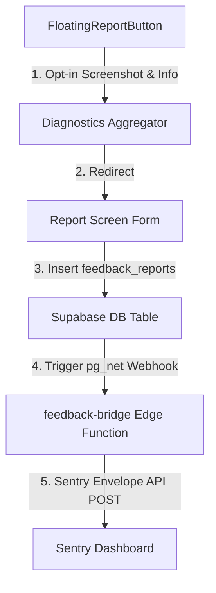

# "Report a Problem" Architecture

This document explains the architecture of the **"Report a Problem"** button in Stash. It details the journey from user tap to Sentry ingestion, highlighting how we capture screenshots on both React Native & Web, preserve privacy by default, and transport large diagnostics reliably.

---

## 🏗️ Architecture Overview

---

## 1. The Trigger: `FloatingReportButton`

The app layout is wrapped globally with the `FloatingReportButton` component in `FloatingReportButton.tsx`.

- **Minimization Mode**: To prevent competing with key app flows (like the inbox "+" action), users can **long-press the button** to minimize it into a small, semi-transparent nub. This preference is persisted locally.
- **Ref/Capture Surface**: The button wraps children inside a target view (`styles.captureSurface`) using a React `RefObject` so we can capture exactly what is on the screen when feedback is requested.

---

## 2. Platform-Specific Screenshot Capture

Capturing screenshots across Web and Native Expo without crashes requires distinct strategies.

### Web Screen Capture (`html2canvas`)

On Web, we load and use `html2canvas`.

- **The Viewport Gotcha**: By default, `html2canvas` renders the element's full scrollable height. If a user has hundreds of cards loaded, this results in massive canvases that crash requests. We explicitly constrain the width and height to the current viewport window bounds.
- **Auto-Downscaling Loop**: Even with viewport bounding, high-DPI screens can generate data URLs exceeding the payload limits. We run a progressive quality retry loop:
  1. `scale: 1.0, quality: 0.74`
  2. `scale: 0.66, quality: 0.60`
  3. `scale: 0.50, quality: 0.45`
     We drop the screenshot only if all three attempts exceed the `MAX_SCREENSHOT_DATA_URL_LENGTH` limit of 1.5MB.

### Native Screen Capture (`react-native-view-shot`)

On iOS and Android, we call `captureRef` from `react-native-view-shot` to produce a local JPG image URI formatted as a data URL.

---

## 3. Privacy-First Diagnostics Context

We gather operational telemetry in `diagnostics.ts`.

- **Privacy by Default**: To keep reports safe to store and share, the diagnostics context **never** includes user-authored content (such as bookmark URLs, search queries, notes, or titles).
- **Aggregated Telemetry**:
  - Coarse system/OS info & routes (e.g., `Expo SDK 56`, `/settings`).
  - Offline sync queue depth & sync status.
  - SQLite preflight & contention diagnostics.
  - Last 150 log entries from our local in-memory log buffer (e.g., `log-buffer.ts`).
  - Last recorded share-intent capture context (extremely useful for debugging failing imports after a crash).
- **User-Approved Screenshot**: The screenshot is treated as a separate, optional toggle. It is only sent if the user leaves the toggle enabled.

---

## 4. Supabase Database & Vault Trigger

When the user submits, we call the client-side API `SupabaseFeedbackApi` to write to the `feedback_reports` table.

1. The client writes `category`, `message`, `app_version`, `platform`, and the `context` JSON.
2. A Postgres trigger (`feedback_reports_bridge_webhook.sql`) is executed immediately on row insertion.
3. This trigger reads the edge function URL and a shared HMAC secret securely stored inside the **Supabase Vault**.
4. It calls `pg_net` to asynchronously POST the row payload to the `feedback-bridge` Edge Function, passing the secret in the `x-feedback-bridge-secret` header.

---

## 5. Ingestion: `feedback-bridge` & Sentry Envelope API

The `feedback-bridge` Edge Function receives the webhook request and uses a custom **Sentry Envelope** (`application/x-sentry-envelope`) request to push directly to Sentry:

1. **Event payload**: Formats the message, tags (e.g., `source: in-app-feedback`, `category`, `platform_os`), and appends the non-screenshot diagnostics JSON inside `extra.diagnostics`.
2. **Binary Attachment**: Decodes the Base64 JPG screenshot from the payload into a `Uint8Array` byte stream and multiplexes it as a separate MIME-type attachment block in the Sentry envelope. This keeps the primary event JSON small, indexable, and fast to read in the dashboard, while keeping the high-resolution screenshot available on the issue page.
