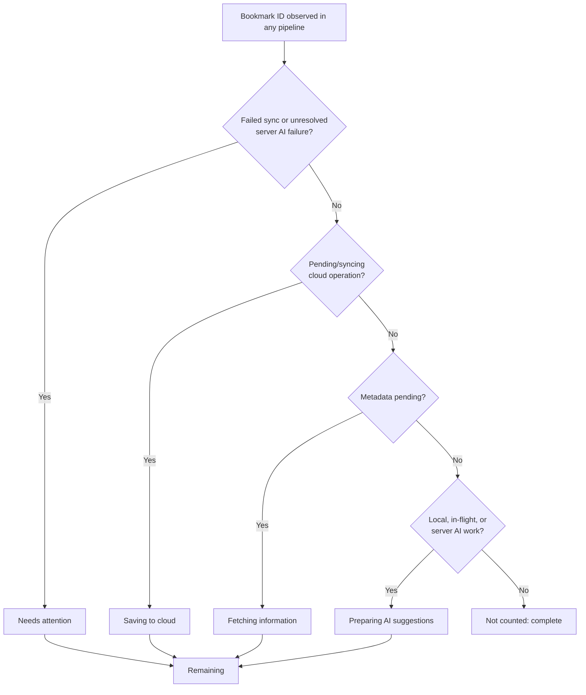

# Settings background-processing counters

Status: implemented 2026-08-05. This supersedes the compact activity-chip
presentation in `settings-activity-status.md`.

## UX contract

Settings answers two different questions without mixing their numbers:

1. **For a user:** how many distinct bookmarks still need work, and what is
   currently blocking each one?
2. **For diagnosis:** what does each local/server queue report, even when the
   same bookmark appears in several queues at once?

The headline and four stage rows use bookmark-ID sets. They are mutually
exclusive and therefore obey this invariant:

```text
remaining = attention + cloud + metadata + AI
```

The visible rows are stable, including zeroes, so the user can scan the same
four places each time:

| Counter | Meaning | Examples of modifiers |
| --- | --- | --- |
| Saving to cloud | Pending or syncing outbox work | local only, paused, saving now |
| Fetching information | Metadata work not already owned by a higher stage | — |
| Preparing AI suggestions | Local, in-flight, or server AI work | AI off, local AI waiting, quota reset time |
| Needs attention | Failed sync or unresolved terminal server-AI failure | highlighted when non-zero |

Pause, AI-off, quota, and degraded fallback are **modifiers or diagnostic
causes**, not additional user-facing totals. This prevents a bookmark from
looking like several different bookmarks.

## Projection from concurrent state

The underlying pipelines remain concurrent. Settings projects each bookmark
into the first matching display stage using this priority:



This is a UI projection, not a replacement for the bookmark sync state
machine documented in
[`../architecture/bookmark-processing-statechart.md`](../architecture/bookmark-processing-statechart.md).

## Processing details

The expandable **Processing details** section intentionally preserves raw,
overlapping counters:

- cloud queue states: pending, syncing, failed;
- cloud operations: create, update, delete;
- cloud health: maximum retry count and oldest queued timestamp;
- metadata: pending, failed, skipped;
- local AI: trigger, dispatch, retry, in-flight;
- server AI: pending, processing, failed;
- rate-limited fallback results.

These numbers are useful for screenshots and support reports. They must not be
added together or compared with the exclusive headline total.

## Data sources

The client combines its local bookmark/outbox/metadata/AI sets with an
account-wide, bookmark-addressable snapshot of `pending_ai_enrichment` from
Supabase. IDs are required: a count-only server total cannot be safely merged
with local queues because their overlap would be unknowable.

The pure projection lives in
`apps/mobile/src/domain/processing-status.ts`; Settings only formats its
result and adds UI modifiers.
