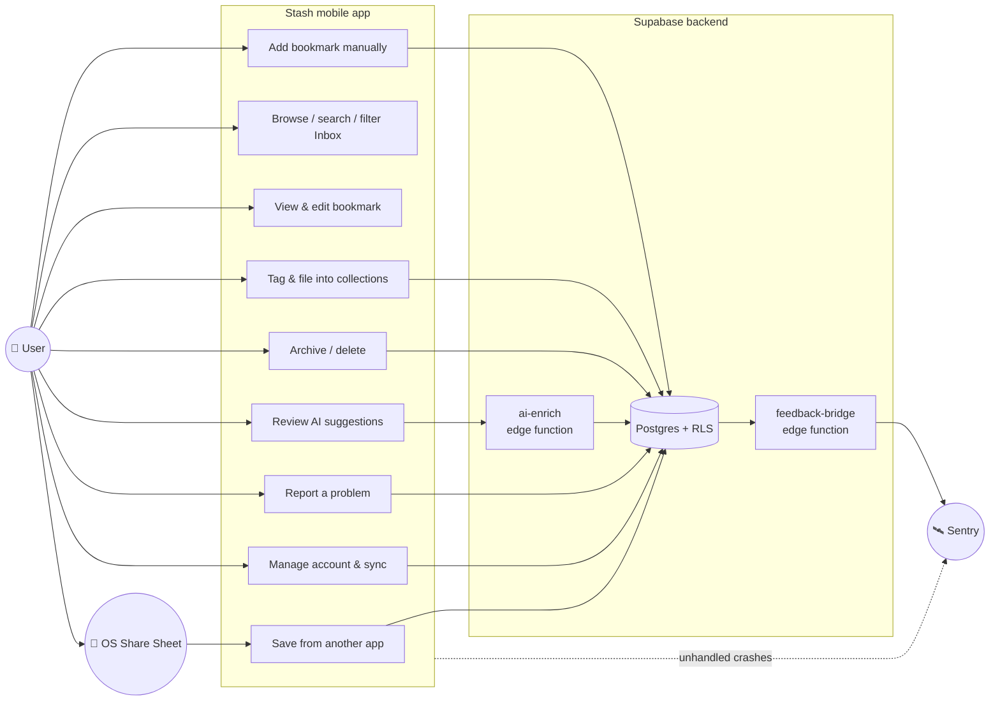
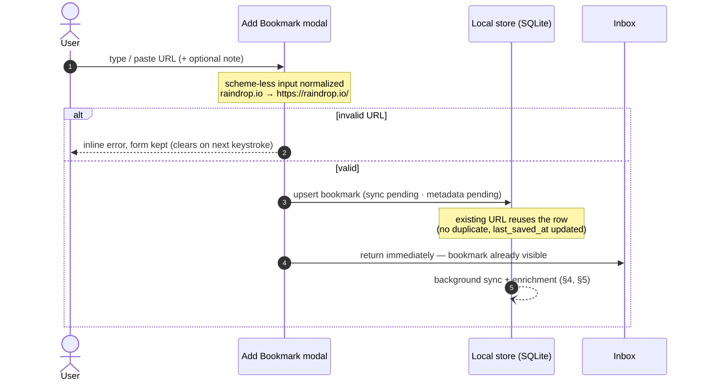
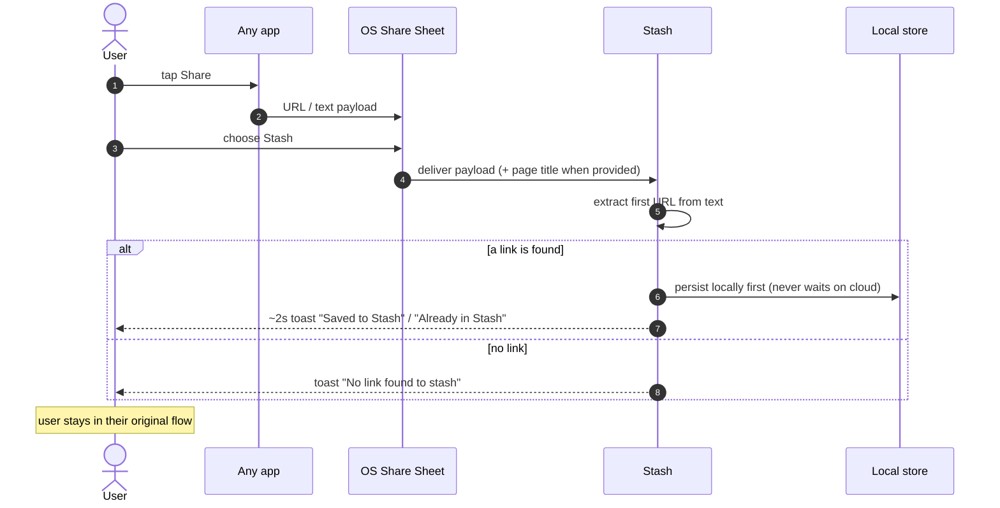
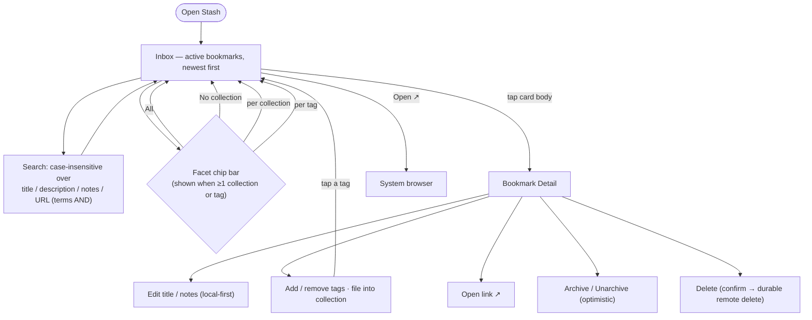
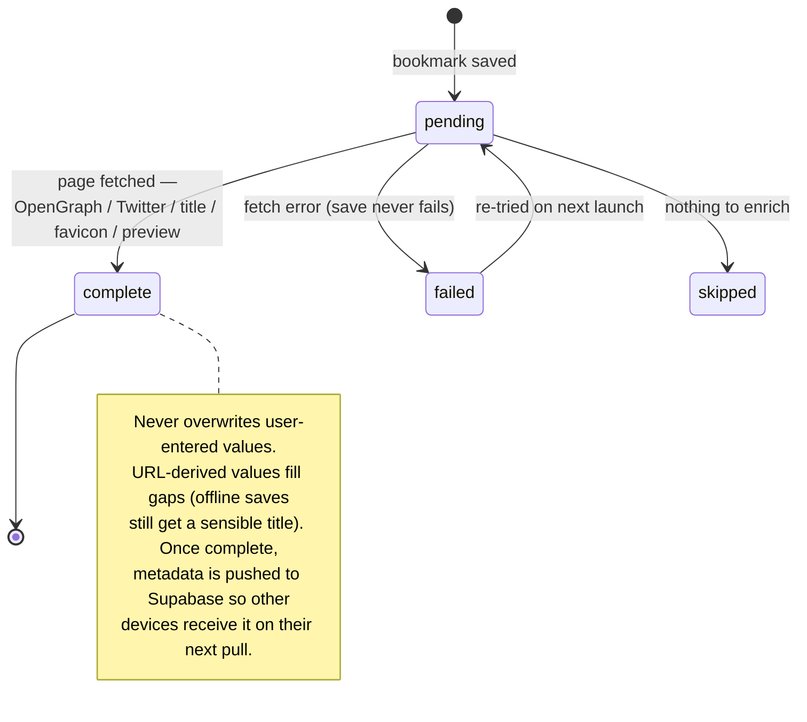
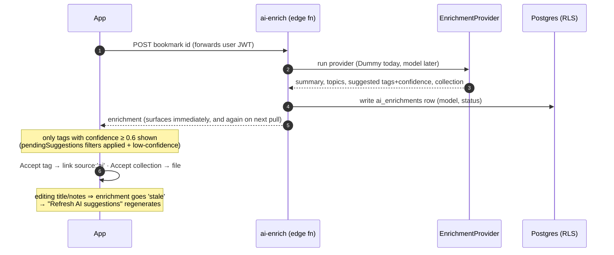
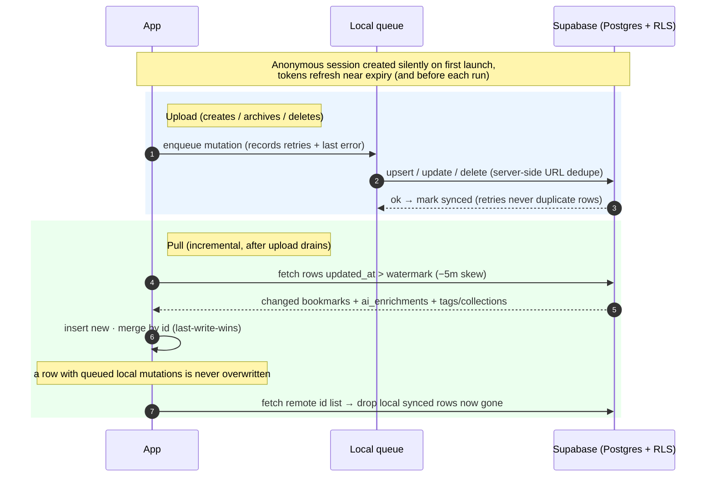
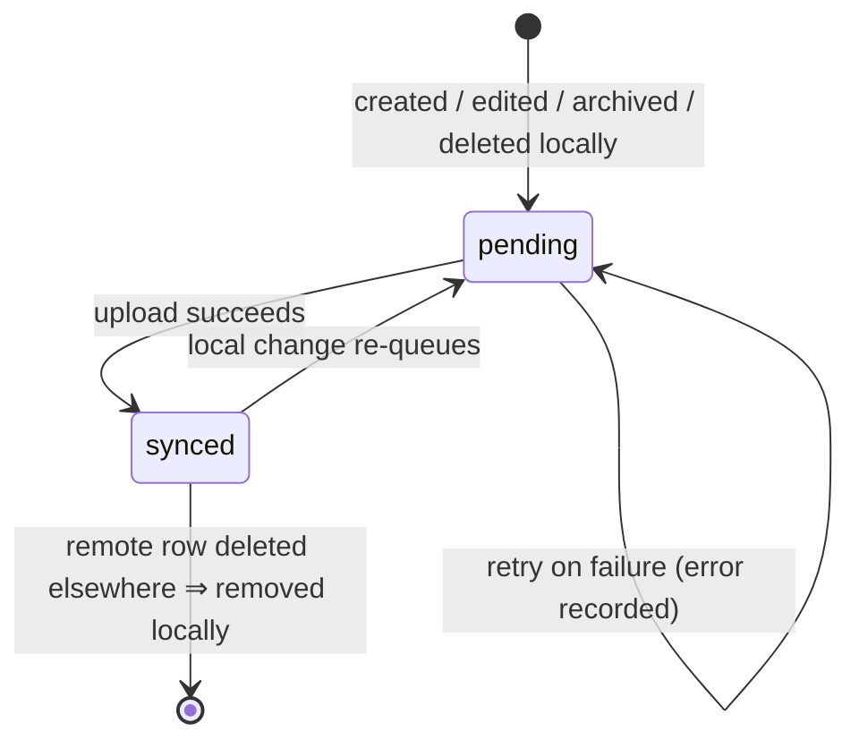
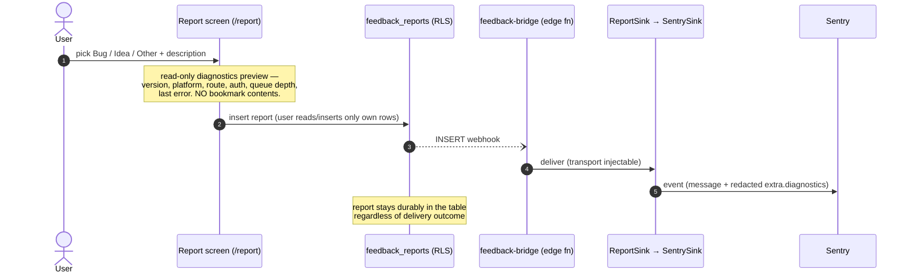
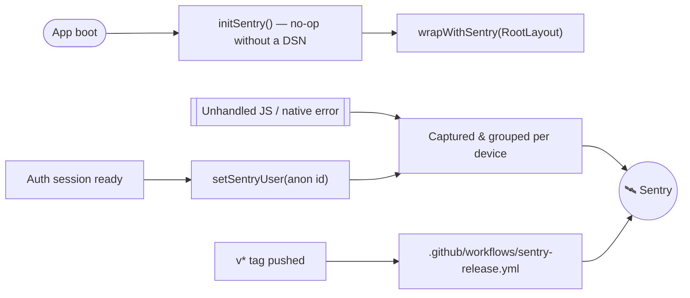

# Stash — Use Cases (Visual)

A visual map of what Stash does and how each flow works end to end. The
authoritative, testable behavior lives in the
[UX spec](ux-spec.md); this page renders the same use cases as diagrams so the
system can be understood at a glance. Section references (e.g. _UX §1.2_) point
back to the spec.

> All diagrams are [Mermaid](https://mermaid.js.org/) and render inline on
> GitHub. Status legend: ✅ implemented & verified · 🔶 implemented, awaiting
> on-device verification.

---

## 1. System context — actors & use cases

Who interacts with Stash, and the capabilities each one drives.

---

## 2. Capture

The first product principle is speed: **capture now, organize later.** Both
capture paths persist locally first and never block on the network.

### 2.1 Manual add — _UX §1.1_

### 2.2 Share intake — _UX §1.2_ 🔶

---

## 3. Browse, search & organize

_References: Inbox & facets UX §2, Detail UX §3, Archive UX §4, Delete UX §5,
Tags/collections UX §11, Search/editing UX §12._

---

## 4. Metadata enrichment (background) — _UX §6_

---

## 5. AI suggestions (server-side auto-tagging) — _UX §7_

Enrichment is produced by the `ai-enrich` edge function behind a **swappable
`EnrichmentProvider` seam** (a deterministic `DummyProvider` ships today). The
user always stays in control — high-confidence tags are surfaced, never
auto-applied.

The **Review queue** (`/review`, from Settings) batches every Inbox bookmark
with pending suggestions for per-tag or "Accept all" actions.

---

## 6. Cloud sync — _UX §8–11_

Local save is the source of immediate confirmation; the cloud is eventually
consistent. Upload drains first, then pull — **local pending work always wins
until uploaded.**

State of a single bookmark's `sync_status`:

---

## 7. Observability

### 7.1 Feedback / issue reporting — _UX §13_ + feedback-bridge

### 7.2 Crash & error monitoring — client SDK

`@sentry/react-native` captures unhandled JS/native errors automatically.
**Off until `EXPO_PUBLIC_SENTRY_DSN` is set**, so local/preview builds never
report by accident; `sendDefaultPii` is `false` and only the opaque anon user
id is attached.

---

## 8. Use-case index

| # | Use case | Status | Spec |
|---|----------|--------|------|
| 1 | Manual add | ✅ | [§1.1](ux-spec.md) |
| 2 | Share intake | 🔶 | [§1.2](ux-spec.md) |
| 3 | Browse / search / facet filter | ✅ | [§2, §12](ux-spec.md) |
| 4 | View & edit bookmark detail | ✅ | [§3, §12](ux-spec.md) |
| 5 | Archive / unarchive | ✅ | [§4](ux-spec.md) |
| 6 | Delete (durable remote) | ✅ | [§5](ux-spec.md) |
| 7 | Background metadata enrichment | ✅ | [§6](ux-spec.md) |
| 8 | AI suggestions + review queue | ✅ | [§7](ux-spec.md) |
| 9 | Account & sync (upload + pull) | ✅ / 🔶 | [§8–11](ux-spec.md) |
| 10 | Tags & collections | ✅ | [§11](ux-spec.md) |
| 11 | Feedback / issue reporting → Sentry | ✅ / 🔶 | [§13](ux-spec.md) |
| 12 | Crash & error monitoring | — | (client SDK) |

---

_See also: [Product spec](product-spec.md) · [Architecture overview](../architecture/overview.md) · [Data model](../architecture/data-model.md) · [Bookmark API](../api/bookmarks.md)._
