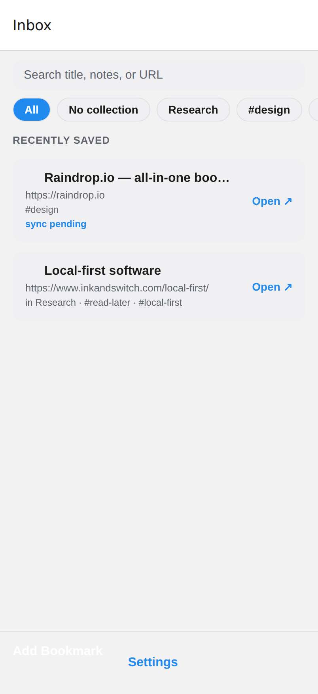
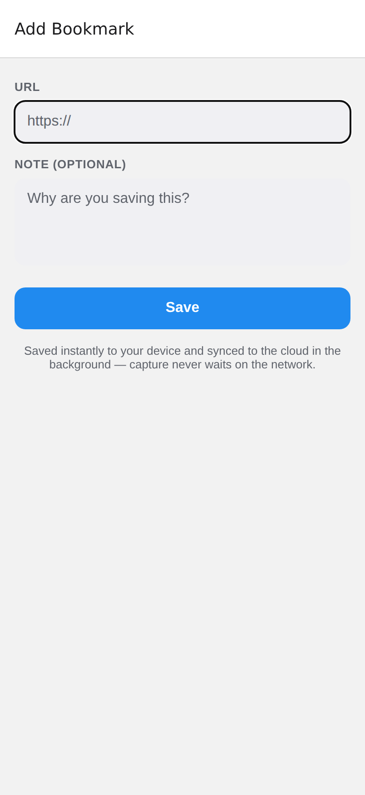
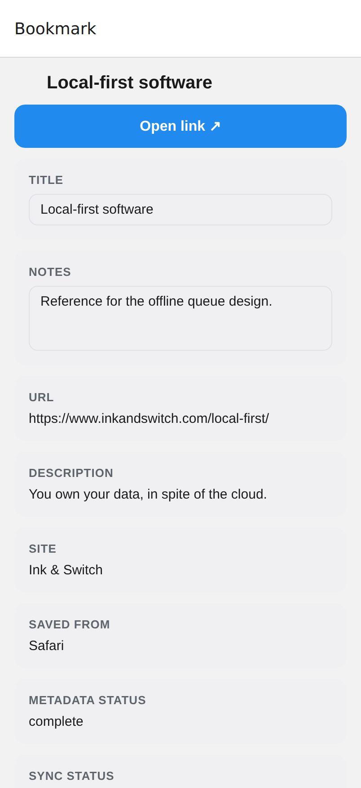
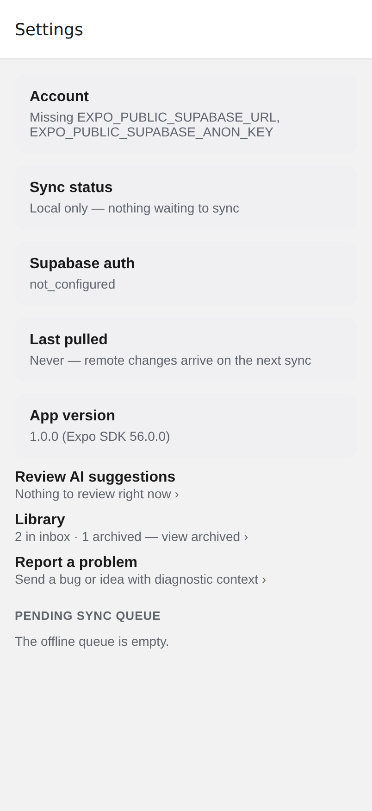
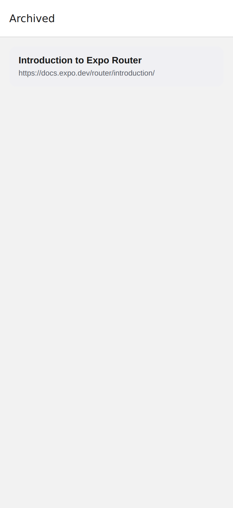
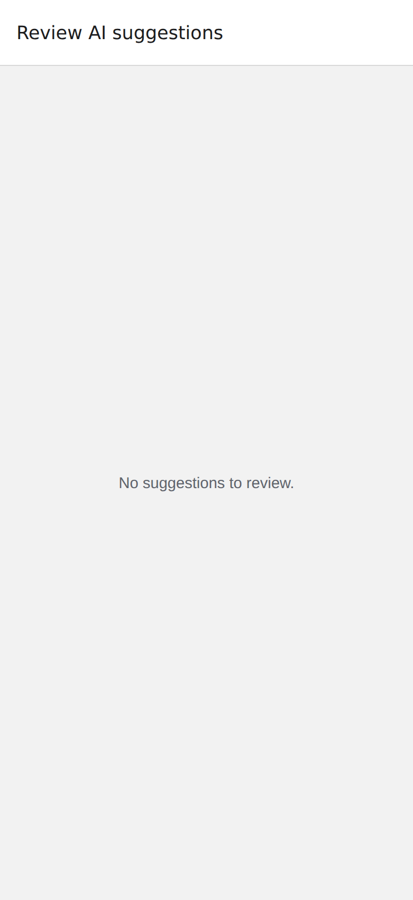
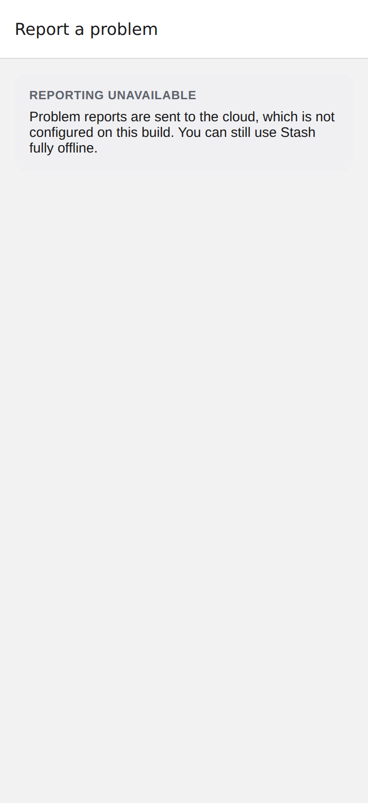

# UX Specification and Status Checklist

The exact, testable behavior of every user-facing flow. Each item carries a
status:

- ✅ implemented and verified (tests / live backend / static render)
- 🔶 implemented, awaiting on-device verification (needs a dev build)
- ⬜ specified but not implemented yet

This document is the source of truth for behavior; `docs/development/milestones.md`
records how we got here. When implementing a ⬜ item, update its status.

## Screens

Captured from the Expo **web** build with seeded sample data
(`expo export -p web`). This capture runs **local-only** — no Supabase is
configured — so the cloud-gated screens honestly show their offline/empty
states. Each screen links to the section that specifies its behavior; see
[use-cases.md](use-cases.md) for the diagrammed flows.

<table>
<tr>
<td align="center" width="33%"> <b>Inbox</b> — per-item icon (favicon or domain monogram), sort control, search, facet chips, sync/tag metadata (<a href="#2-inbox">§2</a>)</td>
<td align="center" width="33%"> <b>Add Bookmark</b> — URL + optional note, instant local save (<a href="#11-manual-add-add-bookmark-modal">§1.1</a>)</td>
<td align="center" width="33%"> <b>Bookmark Detail</b> — open, edit title/notes, metadata, sync state (<a href="#3-bookmark-detail">§3</a>, <a href="#12-search-and-editing">§12</a>)</td>
</tr>
<tr>
<td align="center" width="33%"> <b>Settings</b> — account, sync, library, app version (here in local-only mode) (<a href="#8-account-and-sync-settings">§8</a>)</td>
<td align="center" width="33%"> <b>Trash</b> — deleted bookmarks, restorable until emptied (<a href="#4-trash">§4</a>) <em>(screenshot predates the Archive→Trash rename)</em></td>
<td align="center" width="33%"> <b>Review AI suggestions</b> — batch accept queue (empty here, no cloud) (<a href="#7-ai-suggestions-auto-tagging">§7</a>)</td>
</tr>
<tr>
<td align="center" width="33%"> <b>Report a problem</b> — cloud-gated, so shows the offline notice here (<a href="#13-feedback--issue-reporting">§13</a>)</td>
<td width="33%"></td>
<td width="33%"></td>
</tr>
</table>

## 1. Capture

### 1.1 Manual add (Add Bookmark modal)

- ✅ URL field is auto-focused; keyboard submit saves.
- ✅ Scheme-less input is normalized (`raindrop.io` → `https://raindrop.io/`).
- ✅ Invalid input shows the inline error "Enter a valid web address…" and never
  blocks or clears the form; the error clears on the next keystroke.
- ✅ A valid save returns to Inbox immediately; the bookmark is already visible
  with `sync pending · metadata pending` badges. Saving never waits on network.
- ✅ Saving an already-saved URL reuses the existing bookmark (no duplicate row,
  `last_saved_at` updated) and returns to Inbox. The dedupe key is the
  **canonical** URL (tracking params / fragment stripped), so `…?utm_source=x`
  and the bare URL are the same bookmark — on the client and in the cloud.
- ✅ Capture confirmation is **consistent across capture paths**: the manual Add
  screen shows the same ~2s capture toast the share intake uses — "Saved to
  Stash" for a new save, "Already in Stash" for a duplicate (shared
  `CaptureToastProvider`). Manual add no longer returns silently.
- ✅ An optional note is stored as the user's private `notes`.

### 1.2 Share intake (OS share sheet)

- 🔶 Sharing a URL (or text containing one) from any app saves it without
  opening an editor; the app shows Inbox plus the same ~2s capture toast as
  manual add — "Saved to Stash" / "Already in Stash" / "No link found to stash".
- 🔶 The shared page title (when provided by the source app) becomes the
  bookmark's initial title; enrichment fills the title only when none was
  provided.
- ✅ Capture never waits on cloud sync; the payload is persisted locally first.

## 2. Inbox

Visual polish guidance for the desktop/web Inbox lives in
[web-inbox-visual-polish.md](web-inbox-visual-polish.md); after the font trials,
layout and spacing are the next preferred levers over global typeface swaps.

- ✅ Lists active (not trashed, not legacy-archived) bookmarks, newest first by default.
- ✅ **Sort control**: a header row toggles the order — field (`Date` / `Name`)
  and direction (`↑ Asc` / `↓ Desc`). Date sorts by save time; Name is
  case-insensitive over the title (falling back to URL). The choice persists
  across launches and composes with search and facets. (Logic in
  `@/domain/sort`.)
- ✅ Each card: a leading icon beside the title — the favicon when enrichment
  has one, otherwise a deterministic domain-letter monogram (stable per-site
  color) so no item has a blank slot (`@/domain/item-icon`). Title falls back to
  URL; an inline metadata line (`in <collection>` when filed, plus up to three
  `#tag`s) shows categorization without opening Detail, with status badges —
  sync state shown unless `synced`, plus `metadata pending` while enrichment
  runs.
- ✅ Each card with a URL has an "Open ↗" action that opens the page in the
  system browser without leaving the Inbox; tapping the card body still opens
  Bookmark Detail.
- ✅ Browse facets: a horizontal chip bar (shown only when the Inbox holds at
  least one collection or tag) filters the list in place — `All`, `Inbox`
  (bookmarks not filed into any collection), one chip per collection present,
  and one `#tag` chip per tag present. "Inbox" is the single label for the
  no-collection state across every surface (browse chip, section header, the
  move sheet, and the collection picker), matching the app's inbox-first
  framing — items live in the Inbox until filed. The chips carry an icon
  vocabulary so each one's *kind* is unambiguous: collection chips show a
  folder icon and the `Inbox` chip a tray icon (so it reads as "items not
  filed into any collection", not "items with no tag"); tag chips keep their
  `#` prefix. The *container* chips — folders and the `Inbox` set — also show a
  trailing bookmark count (`Work · 12`), so their weight is visible at a glance
  without a separate cloud; `#tag` chips and `All` stay countless (tags get
  their frequency view from the tag cloud, and `All` is the reset, not a
  bucket). The count is a muted secondary token and never part of the chip's
  label, so the facet-scoped search placeholder still reads "Search in Work". Chips are derived
  from current Inbox content, so each leads to at least one bookmark; the
  section header reflects the active facet and count, and selecting a facet
  composes with search. If the active facet's last member leaves the Inbox,
  the filter falls back to `All`.
- ✅ Loading state ("Loading your bookmarks…"), empty state ("Nothing saved
  yet…"), a filtered-but-empty state ("Nothing in this view yet."), and a
  storage-failure banner (sample data shown, saves may not persist) are all
  distinct.
- ✅ Footer: Add Bookmark (primary), Settings.

## 3. Bookmark detail

- ✅ Shows preview image and favicon when present; title header; URL, title,
  description, notes, tags, collection, site, source app, metadata status,
  sync status, saved-at.
- ✅ **AI suggestions** (see §7): a card shows the enrichment summary, the
  model badge, suggested tags (with confidence) that aren't already applied —
  each acceptable (`＋`, linked with `source: 'ai'`) or dismissable (`×`) — and
  a suggested collection to file into. A "Suggest with AI" / "Refresh AI
  suggestions" action regenerates them on demand for synced bookmarks.
- ✅ When the bookmark has a URL, an "Open link ↗" button opens the page in
  the system browser; a failure to open surfaces a non-blocking inline error.
- ✅ Move to Trash / Restore toggles immediately (optimistic) and persists,
  then returns to the previous screen; a "Moved to Trash" toast offers Undo.
- ✅ Delete asks for confirmation, permanently removes the bookmark, and
  returns to the previous screen.
- ✅ Edit title/notes after capture (see §12).

## 4. Trash

> Archive is retired as a user-facing concept; deleting moves a bookmark to
> Trash. The `is_archived` column survives only to keep legacy archived rows
> (and the dedupe index) out of the Inbox — it has no UI.

- ✅ Trashed bookmarks (`deleted_at` set) leave the Inbox but remain in the
  durable store, recoverable until the Trash is emptied.
- ✅ The Trash screen (Settings → Trash) lists them with per-item Restore and
  a footer "Empty Trash" (confirmation → permanent delete of all).
- ✅ Trashing a cloud-synced bookmark propagates to Supabase (the sync upload
  includes `deleted_at`, last write wins) so trash state reaches other devices.

## 5. Delete

- ✅ Deleting a local-only bookmark cancels any pending upload (tombstones).
  If its upload had already created a remote row mid-flight, a durable delete
  is enqueued for that row, so the removal still reaches the cloud even after
  an app exit or a failed request.
- ✅ Deleting a cloud-synced bookmark enqueues a durable delete that survives
  restarts and permanently removes the remote row; a delete enqueued while
  another sync for the same bookmark is in flight always survives.

## 6. Metadata enrichment

- ✅ After a save is visible, the page is fetched in the background and the
  bookmark gains real title / site name / favicon / preview image
  (OpenGraph/Twitter/`<title>`); URL-derived values fill anything the fetch
  could not provide (offline saves still get a sensible title).
- ✅ Enrichment never overwrites user-entered values, never blocks or fails a
  save; status transitions `pending → complete | failed | skipped`.
- ✅ Bookmarks left `pending` by a previous session are enriched on next launch.
- ✅ Once enrichment completes for a cloud-synced bookmark, the generated
  metadata is pushed to Supabase (via an update mutation), so other devices
  receive the enriched title/site/favicon on their next pull rather than the
  bare create-time payload.

## 7. AI suggestions (auto-tagging)

- ✅ AI enrichment is produced **server-side** by the `ai-enrich` Supabase Edge
  Function: the app POSTs a bookmark id, the function runs the configured
  `EnrichmentProvider`, writes an `ai_enrichments` row (summary, topics,
  suggested tags + confidence, suggested collection, `model`, `status`), and
  returns it. The caller's JWT is forwarded to PostgREST, so RLS scopes every
  read/write to the owner.
- ✅ The provider is a swappable seam. A `DummyProvider` (`model: 'dummy-v0'`)
  ships now — deterministic keyword heuristics, no network — so the whole
  pipeline works before a real model is wired in. Swapping to a model-backed
  provider is a one-line change in the function; schema, sync, and UI are
  unchanged.
- ✅ The app requests enrichment automatically once a new bookmark first syncs,
  and on demand from Bookmark Detail. Results surface immediately from the
  response and again on the next pull.
- ✅ Accepting a suggested tag links it with `source: 'ai'` and its confidence;
  accepting a suggested collection files the bookmark there. Dismissals are
  session-local. Suggestions already applied are hidden.
- ✅ **Staleness:** editing a bookmark's user-editable text (title/notes) after a
  `complete` enrichment exists flips that enrichment to `status: 'stale'`
  (locally and persisted) — it never triggers the network. Bookmark Detail then
  shows an "out of date since you edited this bookmark — refresh to update them"
  hint above the suggestions; the existing **Refresh AI suggestions** button
  regenerates them (status returns to `complete`). Collection/trash changes do
  **not** mark suggestions stale, since they don't alter the enriched text.
- ✅ **Confidence threshold**: only suggested tags with confidence
  `>= 0.6` (`SUGGESTION_MIN_CONFIDENCE` in `apps/mobile/src/domain/ai-suggestions.ts`)
  are surfaced — lower-confidence suggestions are treated as noise and hidden to
  reduce overload. The rule (threshold + applied-name filter, case-insensitive)
  is centralized in `pendingSuggestions(enrichment, appliedTagNames)`, shared by
  the Inbox "✨ N" badge, the Detail card, the Settings count, and the review
  queue. High-confidence suggestions are never auto-accepted — the user stays in
  control.
- ✅ **Review queue** (`/review`, reached from Settings → "Review AI
  suggestions", which shows the total pending count): lists every Inbox bookmark
  with at least one pending suggestion; each row shows the title and its
  suggested-tag chips with per-tag Accept and an "Accept all" for that bookmark.
  A distinct empty state ("No suggestions to review.") shows when nothing is
  pending.

## 8. Account and sync (Settings)

- ✅ Anonymous Supabase account is created silently on first launch when the
  app is configured, restored thereafter, and access tokens refresh
  automatically near expiry (including right before each sync run).
- ✅ Settings shows: account state, sync status (counts of items waiting),
  Supabase auth state, a "Review AI suggestions" row (with the total pending
  count, links to `/review` — see §7), library counts (link to Trash), app
  version, the pending queue (per-entry operation, status, retries, last error),
  and a "Sync now" button whenever there is syncable work.
- ✅ Without Supabase configuration the app is fully usable local-only and
  says so.

## 9. Cloud sync — upload (implemented)

- ✅ New bookmarks, trash changes, and deletes upload automatically when
  auth and local data are ready, and on every new save; failures are
  retryable with recorded errors; retries cannot create duplicate remote
  rows (server-side URL dedupe).
- ✅ Verified end-to-end against the live project (`pnpm verify:supabase`,
  16 checks, including RLS isolation between users).

## 10. Cloud sync — download / pull

The other half of sync: remote changes reach the device. Runs after the
upload queue drains — local pending work always wins until uploaded.

- ✅ **Pull trigger**: on app start (once auth and local load are ready), and
  on "Sync now". Never blocks the UI; Inbox updates in place when rows land.
- ✅ **Incremental pull**: fetch remote bookmarks with
  `updated_at > last_pulled_at` (a persisted watermark). New rows are
  inserted locally with `sync_status: synced`; existing rows merge by ID.
- ✅ **Conflict policy**: row-level last-write-wins by `updated_at`, with one
  exception — a local row with queued (unsynced) mutations is never
  overwritten; its queued upload will re-assert it.
- ✅ **Remote deletions**: each pull also fetches the remote ID list and
  removes local synced rows that no longer exist remotely (permanent deletes
  elsewhere propagate). Local-only rows are untouched.
- ✅ **AI enrichment refresh**: the same pull fetches `ai_enrichments`
  changed since the watermark for owned bookmarks and caches them in the
  durable store; Bookmark Detail reads the cached enrichment (cloud rows win
  over seeded samples), so a summary generated or updated in the cloud
  appears on device on the next pull.
- ✅ **Watermark**: stored in the repository meta store; clock skew is
  tolerated by overlapping the watermark by five minutes (idempotent merges
  make re-pulls harmless). The watermark is captured before fetching so
  changes landing mid-pull are re-fetched next time.
- ✅ **Settings**: shows last successful pull time; "Sync now" performs
  upload-then-pull.
- 🔶 Merge/deletion logic is unit-tested; the pull queries were added to
  `pnpm verify:supabase` and await a re-run from a network-capable session.

## 11. Tags and collections

- ✅ Each pull refreshes an authoritative local snapshot of the user's tags,
  tag links, and collections; Detail shows real data (cloud rows win over the
  seeded samples).
- ✅ Browse: tags and collections are a navigation dimension, not just
  per-bookmark labels — the Inbox facet bar (see §2) filters the list to a
  chosen collection or tag, client-side over the local snapshot. Tapping a tag
  chip in Bookmark Detail also jumps to the Inbox filtered by that tag (via a
  route param); deep-linking survives the load (the facet is not reset before
  the durable store finishes loading).
- ✅ Add/remove tags from Bookmark Detail: tap a tag chip to browse it; tap its
  × to remove; type to add (creates the tag when new). The × and add affordance
  require the cloud connection and a synced bookmark; otherwise a hint explains
  why editing is unavailable (browsing still works).
- ✅ Assign a bookmark to a collection from Detail (chip picker, "Inbox
  (none)" to clear) — local-first: the change applies immediately and queues
  an update mutation. Creating a new collection (and filing the bookmark into
  it) requires the cloud connection.
- ✅ A bookmark filed into a collection while its first upload was in flight
  is reconciled with a follow-up update.
- 🔶 Live verification of the tag/collection queries was added to
  `pnpm verify:supabase` and awaits a re-run from a network-capable session.

## 12. Search and editing

- ✅ Client-side search from the Inbox: case-insensitive over
  title/description/notes/URL; multiple terms AND together; live match count
  and a distinct "no matches" empty state.
- ✅ Title edits save on blur. Memo bodies and personal notes share a selectable
  reading view and an Edit action; an empty note opens for writing in one tap.
  Edits save locally on blur, Done, or leaving Detail, and queue sync without
  waiting for the network. Empty strings clear the field.
- ✅ Each body/note independently selects Plain text or Markdown. New captures
  default to Plain text; existing memo bodies remain Markdown and existing
  personal notes remain Plain text. Only Markdown offers Write/Preview tabs.
  Preview uses the current draft. Changing format never rewrites the source,
  removes syntax, trims whitespace, or truncates an existing long note.
- ✅ Format choices survive sync and JSON backup/restore. Plain-text memo titles,
  Inbox previews, and search keep literal syntax instead of parsing it as Markdown.

## 13. Feedback / issue reporting

In-app, context-aware problem reporting so users can flag bugs and ideas
without leaving the app, with enough diagnostic context to act on.

- ✅ **Entry point**: Settings has a "Report a problem" row that opens the
  report screen (`/report`).
- ✅ **Form**: a category selector (Bug / Idea / Other), a multiline
  description, and a Submit button that stays disabled until the description is
  non-empty.
- ✅ **Diagnostic context preview**: a read-only JSON preview of exactly what
  will be attached — app version, platform, current route, auth status, sync
  queue depth, sync-in-flight, last pull time, and the last operational error.
  Built by a pure, dependency-free helper (`@/domain/diagnostics`) that is
  redacted by default: it never includes bookmark contents (URLs, titles,
  notes). A privacy note states "No bookmark contents are included."
- ✅ **Guarded like other cloud features**: needs an anonymous Supabase
  session; when Supabase is `not_configured` the screen explains reporting is
  unavailable while the rest of the app keeps working offline.
- ✅ **Storage**: submitting inserts a row into `public.feedback_reports`
  (RLS: a user may insert and read only their own rows). Success and error
  states are surfaced inline.
- ✅ **Delivery bridge**: a `feedback_reports` INSERT webhook drives the
  `feedback-bridge` edge function, which forwards each report to Sentry through
  a swappable `ReportSink` (see §15). Reports stay durably in the private table
  regardless of delivery outcome.
- 🔶 **MVP scope**: online submit only — no offline queue (a failed submit is
  retried by the user, not durably queued). A tracked follow-up.

## 14. Release readiness

- ✅ CI runs lint, typecheck, the logic test suite (Node test runner), and the
  component test suite (jest-expo + React Native Testing Library) on every PR
  and push to main.
- ✅ EAS build profiles (development/preview/production) and release docs.
- 🔶 On-device smoke test: the 7-step checklist in
  `docs/development/releasing.md` (save, restart-persistence, share intake,
  trash/delete, sync) has not yet been run on a real device.
- ✅ App icons and splash: Stash bookmark-ribbon mark on the brand blue
  (#208AEF) — main icon, Android adaptive foreground/background/monochrome,
  splash glyph, and web favicon (generated; see `apps/mobile/assets/images`).

## 15. Observability (crash & error monitoring)

Automatic telemetry so failures surface without waiting for a user to report
them. Wired the same way as the rest of the app: pure config + a thin SDK shell.
See [use-cases.md](use-cases.md) §7 for the diagrammed flows.

- ✅ **Client crash capture**: `@sentry/react-native` is initialized at boot and
  wraps the root component, so unhandled JS/native errors and render crashes are
  reported automatically. Decision logic is the pure, unit-tested
  `@/observability/sentry-config`; the SDK call lives in the thin
  `@/observability/sentry` shell.
- ✅ **Off until configured**: nothing is sent unless `EXPO_PUBLIC_SENTRY_DSN`
  is set, so local/preview builds never report by accident. `sendDefaultPii` is
  `false`; only the opaque anonymous Supabase user id is attached
  (`setSentryUser`), so crashes can be grouped per device without PII.
- ✅ **Feedback → Sentry bridge** (server): the `feedback-bridge` edge function
  delivers in-app reports (§13) to Sentry via a swappable `ReportSink`
  (`SentrySink` today; the HTTP transport is injected so it's testable without
  the network). The DSN/secret live server-side, off-device.
- ✅ **Release tooling**: the CircleCI `sentry_release` job creates a Sentry
  release and associates commits on `v*` tags (skips cleanly without secrets).
  Source maps upload during EAS Build via the `@sentry/react-native/expo`
  config plugin.
- 🔶 **Configuration pending**: live reporting, native crash capture, EAS
  source-map upload, and the tagged release workflow need the Sentry
  DSN/org/project/auth-token set; not yet exercised against a live project.
